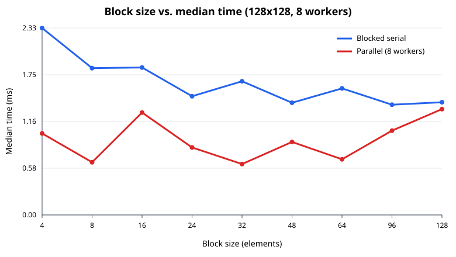
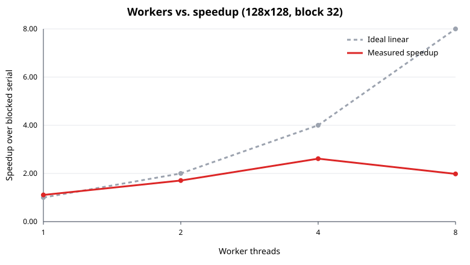

# Benchmark results

- Environment: Node v18.19.1, AMD Ryzen 7 9700X 8-Core Processor
- Reported cores: 16; benchmark cap: 8 worker threads
- Shape: 128x128 * 128x128; repetitions per point: 1; statistic: median
- Best block size by parallel median time in this sweep: 32
- Naive i-k-j baseline: 4.885 ms

## Block-size curve

| Block | Serial ms | Parallel ms | Serial GFLOPS | Parallel GFLOPS |
|---:|---:|---:|---:|---:|
| 4 | 2.327 | 1.015 | 1.802 | 4.132 |
| 8 | 1.828 | 0.656 | 2.295 | 6.392 |
| 16 | 1.836 | 1.275 | 2.285 | 3.289 |
| 24 | 1.478 | 0.840 | 2.838 | 4.992 |
| 32 | 1.664 | 0.634 | 2.520 | 6.619 |
| 48 | 1.397 | 0.909 | 3.002 | 4.615 |
| 64 | 1.576 | 0.693 | 2.662 | 6.053 |
| 96 | 1.373 | 1.050 | 3.056 | 3.995 |
| 128 | 1.403 | 1.318 | 2.989 | 3.183 |

Small blocks have more block-loop overhead and may under-use each cache line. Very large blocks stop fitting comfortably in L1/L2, so reused B and C values are evicted more often; they also shrink the tile count to ceil(M/B)*ceil(N/B), which can leave most workers idle. On this Node/i-k-j workload the unblocked serial run is competitive, but the parallel optimum is near 32: a block needs to be cache-friendly while still producing many more tiles than workers. Use that range as a starting point and tune once on the target CPU.

## Thread scaling

| Workers | Parallel ms | Speedup | Efficiency |
|---:|---:|---:|---:|
| 1 | 1.501 | 1.109 | 110.865% |
| 2 | 0.975 | 1.707 | 85.336% |
| 4 | 0.637 | 2.613 | 65.335% |
| 8 | 0.840 | 1.981 | 24.761% |

Speedup is sublinear because the machine has shared memory bandwidth and cache capacity, worker startup/message synchronization has fixed overhead, OS scheduling and SMT threads do not add equal execution capacity, and work is divided by output tiles so irregular shapes or a small number of tiles can leave load imbalance. When the requested worker count exceeds usable tiles, extra workers are deliberately not launched.

## Memory bound

For an MxK times KxN product, the library stores one C and shares A/B by SharedArrayBuffer. The floating-point payload is 8(MK + KN + MN) bytes: the caller's A and B plus exactly one output C, with no per-block copies. At this benchmark size that is 0.38 MiB. Workers do not receive block arrays; each worker receives constant-size metadata (approximately 256 bytes), giving a measured-configuration upper bound near 0.38 MiB plus Node runtime/thread stacks.
